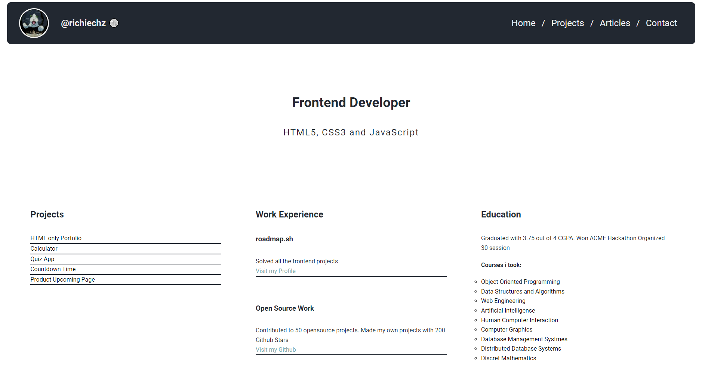

# Porfolio Personal

**Convert the previous simple HTML website into a personal portfolio.**

>The goal of this project is to teach you how to style a website using CSS. You will take the structure from the [previous HTML-only project](https://roadmap.sh/projects/basic-html-website) and apply various CSS techniques to enhance its appearance and responsiveness.

## Submission Requirements

Your submission should include:

- A fully styled, responsive website with the same structure as the previous project.
- Consistent use of a chosen color scheme and typography.
- Proper use of CSS techniques like Flexbox, media queries, and the box model.
- A responsive navigation bar and well-styled contact form.

## Bonus Points

For bonus points, you can:

- Use [Google Fonts](https://fonts.google.com/) to enhance the typography of your website.
- Look into [GitHub Pages](https://pages.github.com/) or [Cloudflare Pages](https://pages.cloudflare.com/) to host your website for free.
- Add support for dark mode using CSS variables.

# Website Preview

Visita el sitio:
https://richiechz-dev.github.io/Personal-Portfolio/
